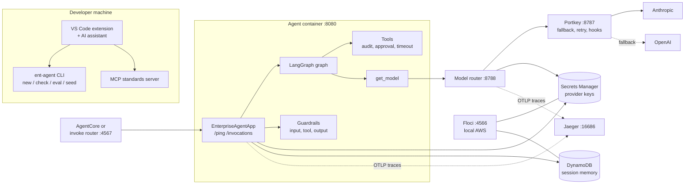
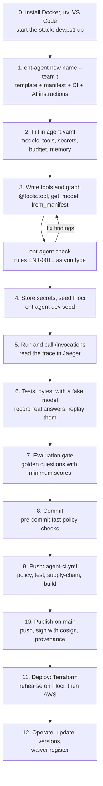
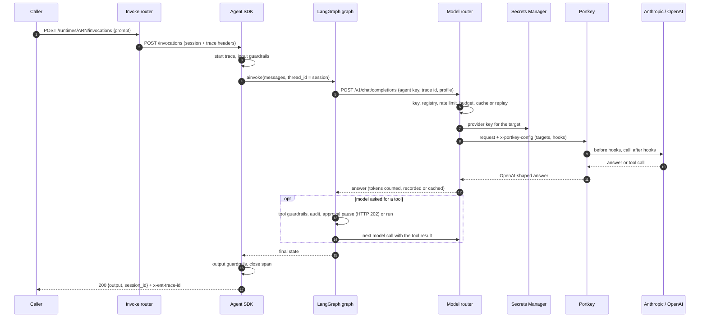
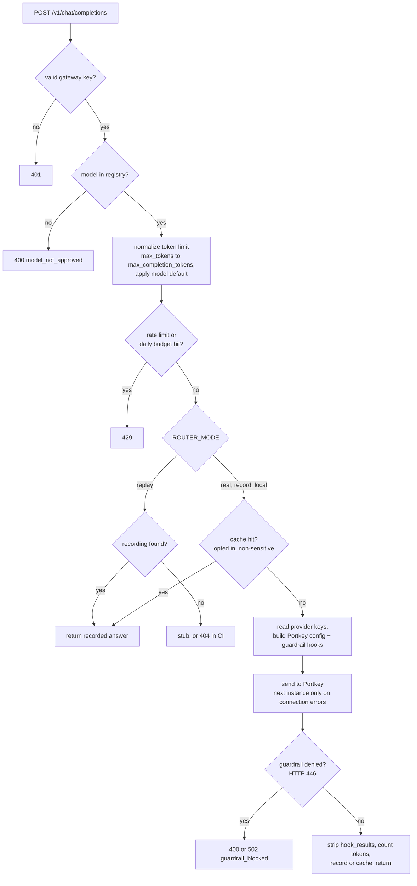
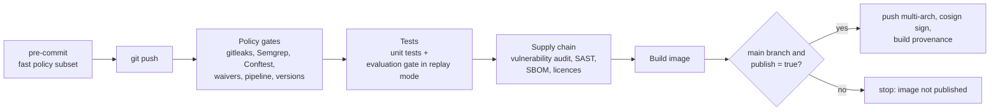
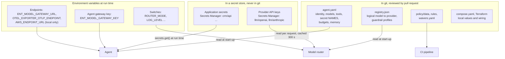

# Platform 2.0 guide: how it fits together

A learning guide for people new to the platform. It explains the moving parts with diagrams. The detail (every requirement,
every function, every endpoint, every config file) is in the author's learning workbook (an Excel file that is not part of
this repository; `docs/requirements-traceability.md` and the code hold the same facts); each section below names the sheet it comes from.

> **Viewing the diagrams.** The diagrams are Mermaid. They render in GitHub and in VS Code's Markdown preview (install
> the "Markdown Preview Mermaid Support" extension if you only see code). Section 1 also has a plain-text version.

## 1. The big picture

Every agent is a normal LangGraph graph wrapped by one SDK. The SDK gives it the same HTTP contract, tracing, guardrails,
secrets, budgets and memory. All model calls go through one gateway path. CI enforces the rules before anything is built.

```text
 Developer (VS Code + AI assistant)                      Platform team
   |  ent-agent new / check, extension, MCP server          |  registry.json, policy/, templates, pipeline
   v                                                        v
 +--------------------------- one agent container (port 8080) ------------------------------+
 |  EnterpriseAgentApp (SDK)                                                                 |
 |   GET /ping   POST /invocations --> guardrails(in) --> LangGraph graph --> guardrails(out)|
 |                                          |  tools (guardrails, audit, approval, timeout)  |
 |                                          |  memory (in-memory or DynamoDB)                |
 |                                          |  secrets.get() --> Secrets Manager             |
 |                                          +-- get_model("chat-default") --+                |
 +--------------------------------------------------------------------------|----------------+
        ^ called by AgentCore (AWS) or the local invoke router (:4567)       v
                                                          model router (:8788): key check, registry, limits,
   traces (OTLP) ----------------------------> Jaeger     cache, record/replay, provider keys
                                                                            |
                                                          Portkey gateway (:8787): fallback, retry, guardrail hooks
                                                                            |
                                                                  Anthropic  ->  (fallback) OpenAI
 Local AWS stand-in: Floci (:4566) = Secrets Manager, DynamoDB, S3, STS, AgentCore control plane
```



Next: workbook sheets **Integrations** and **Glossary**.

## 2. The journey of a new agent



Next: workbook sheet **Build Sequence** (commands and what happens behind the scenes for each step).

## 3. What happens on one call



Errors you can meet on this path: 400 `GuardrailBlocked`, 429 `BudgetExceeded`, 502 `GuardrailBlocked`, 503 `GatewayUnavailable`,
500 `AgentError` (sheet **Agent Errors**). Next: sheets **Request Flow** and **API Contracts**.

### 3.1 Inside the model router



## 4. How the pipeline enforces the rules



Next: workbook sheets **Config Files** (policy and pipeline files) and **Requirements Traceability** (POL-xx rows).

## 5. Where configuration and secrets live



Rules of thumb:

- A **secret value** is only ever in Secrets Manager (Floci locally). Code and `agent.yaml` hold its *name*.
- **Identity and policy choices** (who the agent is, which models and tools it may use) are in `agent.yaml`, so reviewers and policy see them.
- **Where things are** (endpoints, mode) are environment variables, so the same image runs locally and in AWS.
- **Approved choices** (model registry, allow-lists, rules) are repository files changed through pull requests.
- In AWS, credentials are an IAM role; the dummy `test` keys and `AWS_ENDPOINT_URL` exist only on a developer machine.
- The provider keys used for testing were pasted into a chat session on 2026-10-06. Treat them as exposed and rotate them.

Next: workbook sheets **Config and Secrets Storage** and **Env Vars**.

## 6. Try it yourself (30 minutes)

1. `.\harness\dev.ps1 up -Mode replay`, then open Jaeger (http://localhost:16686) and Floci UI (http://localhost:4500).
2. Create an agent and run it (`instructions.txt`, section 7), then call it with `.\harness\call-agent.ps1 -Port 8091 -Prompt "Say hello in exactly three words."`. The script prints the trace ID and the call tree; open that trace in Jaeger. You should see `invoke_agent`, a `chat` span, and the `router chat` span.
3. In your agent's folder run `uv run ent-agent check .`, then break a rule on purpose (add `import openai` and `client = openai.OpenAI()` to `agent.py`) and read the finding with `uv run ent-agent rules ENT-002`.
4. Add a tool with `side_effects=True`, call the agent, and resume it from the 202 response with `{"resume": {"approved": true}}`.
5. Open `harness/model-router/registry.json`, read how `chat-default` falls back from Anthropic to OpenAI, then find where the router builds that into a Portkey config (`registry.portkey_config` in `harness/model-router/src/model_router/app.py`).

## 7. Keeping the learning material current

| Artifact | Source of truth | Rebuild |
|---|---|---|
| Workbook | docs/requirements-traceability.md, the code (read automatically), `docs/learning/descriptions/*.json`, `scripts/learning_content.py` | `python scripts/build_learning_workbook.py` (needs `openpyxl`; close the file in Excel first) |
| Rules page | `rules_catalog.py` | a test fails if the generated page is stale |
| This guide | hand-written | edit it when the flow changes |

New or renamed functions show up in the workbook's Code Reference automatically, with the description "(no description yet)" until one is added to
`docs/learning/descriptions/`. The build fails if a path or environment variable it documents no longer exists.
