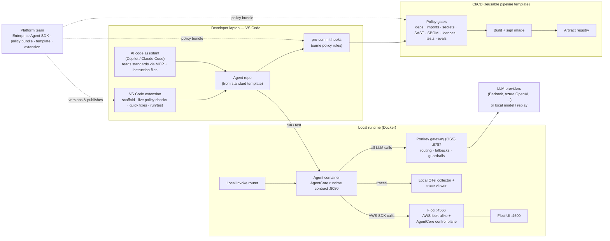

# Platform 2.0: Standardized Agentic Development — Requirements Specification

| | |
|---|---|
| **Status** | Draft v0.3 for review (v0.2: Portkey adopted as the LLM gateway; v0.3: SDK resilience added, coding standards delivered via the IDE plugin + policy bundle) |
| **Date** | 2026-10-05 |
| **Owner** | Devashis Ghosh |
| **Working name** | "Platform 2.0" (the Enterprise Agent Platform) |

---

## 1. Vision

Every agent built in the enterprise is built the same way: on one approved **Enterprise Agent SDK** that wraps
LangGraph/LangChain and bakes in observability, security, and secret management. All model traffic flows
through one **LLM gateway (Portkey)**. **CI/CD refuses to build**
anything that doesn't follow the rules. Developers can **run and test their agents locally** against an
AgentCore-compatible runtime and an AWS look-alike (Floci) before touching a real account, and a **VS Code
extension** guides them and their AI code assistants toward compliant code from the first keystroke.

**Guiding principle: make the compliant path the easiest path.** Enforcement in CI is the backstop, not the
primary experience — the SDK, template, and IDE plugin should mean developers rarely hit a CI failure.

## 2. Goals and success measures

| # | Goal | Measure (target) |
|---|------|------------------|
| G1 | Standardize how agents are built | 100% of agent repos built on the Enterprise Agent SDK within 2 quarters of GA |
| G2 | Enforce standards before build | 0 agent builds reach an artifact registry without passing policy gates |
| G3 | Fast local inner loop | New developer goes from zero to a running, tested agent locally in < 30 min |
| G4 | Observability by default | 100% of agent invocations emit traces with the standard attributes, with no developer code |
| G5 | No secrets in code or config | 0 secret-scanning findings in agent repos; all secrets fetched via SDK at runtime |
| G6 | Low friction | < 10% of PR builds fail on policy gates after month 3 (caught earlier in IDE / pre-commit) |

## 3. Scope

**In scope**
- Enterprise Agent SDK (Python first) wrapping LangGraph and LangChain.
- Standard project template and scaffolding.
- Policy-as-code rules, shared by IDE, pre-commit hooks and CI/CD.
- CI/CD enforcement gates (reusable pipeline templates).
- Local runtime and test harness: Floci + an AgentCore-compatible agent container.
- VS Code extension, including context for AI code assistants.
- Governance: SDK versioning, exception (waiver) process, compliance reporting.
- LLM gateway integration: **Portkey** for all model access (open-source gateway locally and in CI; production
  deployment model to be decided — see §7.6 and open questions).

**Out of scope (this phase)**
- Production deployment platform design (assumed: Amazon Bedrock AgentCore in real AWS accounts).
- Languages other than Python (TypeScript is a candidate for phase 4).
- Agent frameworks other than LangGraph/LangChain (Strands, CrewAI etc. are "not approved" by default).
- Building our own LLM gateway (Portkey is the chosen gateway).
- Forking or modifying Portkey itself.

## 4. Personas

| Persona | Needs |
|---------|-------|
| **Agent developer** | Start fast, clear rules, quick feedback, test locally without cloud access |
| **Platform team** (owns SDK, template, plugin) | Ship standards once, roll out upgrades safely, see adoption |
| **Security / risk** | Guarantee guardrails, secret handling, approved models/tools; audit evidence |
| **DevOps / SRE** | Standard pipelines, consistent telemetry, predictable deployments |
| **Engineering managers** | Compliance and adoption dashboards per team |

## 5. Key constraint discovered: what Floci can and can't do for AgentCore

Verified on 2026-10-05 against Floci 2.1.0 running locally (121 services emulated, including
`bedrock-agentcore`, `bedrock-agentcore-control` and `bedrock-runtime`):

- **Floci emulates the AgentCore control plane**: creating, listing, updating and deleting agent runtimes,
  endpoints, gateways, memory, workload identity and tags, as a stateful registry.
- **Floci does NOT execute agent code.** `InvokeAgentRuntime` returns a canned response
  (`{"output":"yes"}`). Real inference, streaming, the policy engine and IAM enforcement are out of scope for
  Floci ([Floci AgentCore design](https://floci.io/floci/design/bedrock-agentcore/)).

**Consequence for this design:** "run in AgentCore through Floci" is split into two complementary parts:

1. **Execution** — the developer's agent runs locally as a container that honours the
   [AgentCore Runtime contract](https://docs.aws.amazon.com/bedrock-agentcore/latest/devguide/runtime-getting-started.html)
   (HTTP server, `POST /invocations`, `GET /ping`, port 8080). This is the same image that will later be deployed
   to real AgentCore.
2. **Surrounding services + deployment rehearsal** — Floci provides the AWS services the agent depends on
   (Secrets Manager, S3, DynamoDB, SQS, CloudWatch Logs, etc.) and the AgentCore control plane, so the
   *deployment* scripts/IaC can be exercised end to end without a real account.

A thin **local invoke router** (part of the harness) makes `InvokeAgentRuntime` calls reach the local agent
container instead of Floci's stub, so test code is identical locally and in real AWS. If Floci later adds
container-backed invoke (as it already does for Lambda), the router can be retired.

## 6. Solution overview

**One policy bundle, three enforcement points.** The same versioned rules run in the IDE (instant feedback),
in pre-commit (before code leaves the laptop), and in CI (the gate that can't be skipped).

## 7. Functional requirements

Priorities use MoSCoW: **M** = Must, **S** = Should, **C** = Could, **W** = Won't (this phase).

### 7.1 Enterprise Agent SDK (`ent-agent-sdk`, Python)

| ID | Requirement | Pri | Acceptance criteria |
|----|-------------|-----|---------------------|
| SDK-01 | Provide a single entry point (e.g. `EnterpriseAgentApp`) that wraps a LangGraph graph and serves it on the AgentCore runtime contract (`/invocations`, `/ping`, port 8080) | M | A template agent built with the SDK runs locally in Docker and on real AgentCore with no code changes |
| SDK-02 | Pin and re-export approved versions of `langgraph`, `langchain-core` and approved LangChain integrations | M | Installing the SDK resolves exactly the approved versions; a compatibility matrix is published per SDK release |
| SDK-03 | **Observability by default**: auto-instrument graphs, nodes, LLM calls and tool calls with OpenTelemetry using GenAI semantic conventions; propagate trace context; structured JSON logs correlated with trace IDs | M | Every invocation produces a trace with standard attributes (agent name, version, team, model, tokens, latency, tool names, outcome) without developer code |
| SDK-04 | Exporter configuration is environment-driven (local collector, enterprise backend, AgentCore Observability/CloudWatch) | M | Switching environment changes the destination only via config |
| SDK-05 | **Secret management**: a `secrets.get(name)` API backed by AWS Secrets Manager (and SSM Parameter Store), with caching and rotation-safe refresh; works against Floci locally | M | No secret is read from env vars or files in template code; local runs fetch from Floci's Secrets Manager |
| SDK-06 | **Identity**: outbound calls to tools/APIs use workload identity (AgentCore Identity) / short-lived credentials, never static keys | M | Template tool calls authenticate without any long-lived key in code or config |
| SDK-07 | **Model access via an approved model registry, routed through Portkey**: models are requested by logical name (e.g. `chat-default`); each name maps to a centrally managed Portkey config (provider, model, fallbacks, retries). The SDK returns a LangChain chat model pointed at the Portkey gateway — never a direct provider client | M | Requesting an unapproved model fails with a clear error; changing a logical name's provider/model needs no agent code change |
| SDK-08 | **Guardrails (layered)**: (1) Portkey gateway guardrails on every LLM request/response; (2) SDK graph middleware for checks the gateway can't see (tool inputs/outputs, prompt injection in retrieved content, PII in state) using Bedrock Guardrails or an approved equivalent | M | Both layers on by default; disabling either requires an approved waiver flag that CI detects |
| SDK-09 | **Tool registry and allowlist**: tools are declared with metadata (owner, data classification, side effects); only registered tools can be bound | S | Binding an unregistered tool fails at startup; tool metadata appears in traces |
| SDK-10 | Human-in-the-loop helpers for tools with side effects (approval interrupts using LangGraph `interrupt`) | S | Tools marked `side_effects=true` require an approval step unless waived |
| SDK-11 | Standard memory/state adapters (AgentCore Memory, DynamoDB checkpointer) | S | Template agent persists conversation state locally (Floci) and in AWS with config-only changes |
| SDK-12 | Cost and token budgets per agent/invocation with telemetry and soft/hard limits; uses Portkey budgets/rate limits where available (see GW-07), SDK-side counting otherwise | S | Exceeding a hard budget stops the run with a standard error and a span event |
| SDK-13 | Audit events for security-relevant actions (tool calls with side effects, guardrail blocks, waivers in effect) | M | Audit events are emitted to a dedicated stream with agent and user identity |
| SDK-14 | Embedded SDK metadata (name, version, policy-bundle version) in the built image | M | CI and runtime can read and report which SDK/policy versions an agent uses |
| SDK-15 | TypeScript SDK | W | Phase 4 candidate |
| SDK-16 | **Resilience (thin, complements Portkey)**: the SDK handles what the gateway can't — timeouts and bounded retries with backoff for AWS calls (secrets, memory, S3) and tool/API calls; `/ping` reports `HealthyBusy`/unhealthy honestly; graceful shutdown lets in-flight requests finish; a gateway outage surfaces as one clear error. **LLM-call resilience (retries, fallbacks, timeouts, load balancing) is Portkey's job** (GW-03) — the SDK does not add its own LLM retries, to avoid retry storms | M | A dependency outage produces a clear, typed error within the configured timeout; no unbounded waits; no silent fallback to a direct provider |

### 7.2 Project template and scaffolding

| ID | Requirement | Pri | Acceptance criteria |
|----|-------------|-----|---------------------|
| TPL-01 | Cookiecutter/Copier template creating a ready-to-run agent repo: SDK wiring, Dockerfile (AgentCore contract, ARM64 + AMD64), `compose.yaml` for local runtime, tests, pipeline file, pre-commit, `agent.yaml` manifest | M | `scaffold → docker compose up → invoke` works in < 30 min on a clean laptop |
| TPL-02 | `agent.yaml` manifest declaring agent name, owner team, data classification, models (logical names), tools, secrets, guardrail profile | M | Manifest is schema-validated in IDE, pre-commit and CI |
| TPL-03 | Template updates can be pulled into existing repos (Copier update or equivalent) | S | A template change can be applied to a generated repo with a reviewable diff |
| TPL-04 | Includes `CLAUDE.md` / `AGENTS.md` / `.github/copilot-instructions.md` describing the standards for AI assistants | M | AI assistants in the repo get the rules without manual setup |

### 7.3 Policy-as-code and CI/CD enforcement

All rules live in one versioned **policy bundle** (e.g. OPA/Conftest for manifests and dependency metadata,
Semgrep for code patterns, plus standard scanners). The same bundle runs in IDE, pre-commit and CI.

| ID | Requirement | Pri | Acceptance criteria |
|----|-------------|-----|---------------------|
| POL-01 | **Dependency allowlist**: only approved packages/versions; `ent-agent-sdk` is required; direct pins to non-approved LangChain/LangGraph versions are rejected | M | A PR adding an unapproved dependency fails with a message naming the package and the approved alternative |
| POL-02 | **Required usage patterns**: agents must start via the SDK entry point; LLMs created via the model registry (and therefore Portkey); secrets via `secrets.get` | M | Semgrep rules flag `ChatOpenAI(...)`/`ChatBedrock(...)`/`ChatAnthropic(...)` constructed directly, raw provider SDK clients (`openai`, `anthropic`, `bedrock-runtime`), hard-coded provider base URLs, `os.environ["*KEY*"]` reads, raw `boto3` Secrets Manager calls outside the SDK |
| POL-03 | **Secret scanning** (e.g. gitleaks) on every commit and PR | M | Any detected secret blocks the build |
| POL-04 | **SAST and dependency vulnerability scanning**, with severity thresholds | M | Critical/high findings block; medium findings reported |
| POL-05 | **SBOM generation and licence policy** | M | SBOM attached to every build; disallowed licences block |
| POL-06 | **Manifest validation** (`agent.yaml` schema + rules, e.g. "restricted data ⇒ guardrail profile `strict`") | M | Invalid or non-compliant manifests block |
| POL-07 | **Tests required**: unit tests + local integration tests against the local runtime (Floci + agent container) in CI | M | CI spins up the local runtime in the pipeline and runs integration tests |
| POL-08 | **Agent evaluation gate**: a golden-question evaluation set with minimum scores (task success, groundedness, safety) | S | Scores below thresholds block merge to main; results stored as build artifacts |
| POL-09 | **Image signing and provenance** (e.g. Sigstore/cosign, SLSA provenance) | S | Only signed images with provenance can be deployed |
| POL-10 | **Reusable pipeline template** (GitHub Actions / GitLab CI / Azure DevOps — see open questions), centrally versioned; repos cannot override gate steps | M | Repos reference the template; removing a gate fails a meta-check |
| POL-11 | **Waiver process**: time-boxed, approved exceptions recorded in the repo and a central register, visible in CI output and dashboards | M | A waiver without an approver or expiry is rejected; expired waivers fail the build |
| POL-12 | Clear, actionable failure messages with a link to the fix and the rule's rationale | M | Every rule has an ID, message, docs link and (where possible) an automated fix |
| POL-13 | Pre-commit hooks running the fast subset of rules | M | Local commit is blocked on the same rules CI enforces (except slow ones) |

### 7.4 Local runtime and test harness (Floci + AgentCore-compatible container)

| ID | Requirement | Pri | Acceptance criteria |
|----|-------------|-----|---------------------|
| RUN-01 | One command (`ent-agent dev up` or `docker compose up`) starts: Floci, Floci UI, local OTel collector + trace viewer, the **Portkey OSS gateway**, the agent container, and the local invoke router | M | All components healthy in < 2 min after images are cached |
| RUN-02 | Agent container runs the **same image** that will be deployed to AgentCore | M | No local-only code paths in the agent; differences are config only |
| RUN-03 | **Local invoke router**: `InvokeAgentRuntime` calls (AWS SDK/CLI) with `--endpoint-url` to the router are forwarded to the local agent container; other AgentCore calls pass through to Floci | M | Test code that calls `invoke_agent_runtime` works unchanged locally and in AWS |
| RUN-04 | **Seed data**: secrets, S3 objects, DynamoDB tables and AgentCore resources (runtime, endpoint, memory, gateway) created from the repo's manifest at startup | M | Fresh environment matches `agent.yaml` without manual steps |
| RUN-05 | **Deployment rehearsal**: the same IaC/deploy scripts used for AWS (Terraform/CDK/CLI) can target Floci | S | `deploy --env local` creates the AgentCore runtime and dependencies in Floci and passes smoke checks |
| RUN-06 | **LLM in local runs** — always through the local Portkey gateway, which routes to one of: (a) a real provider with dev credentials, (b) a record/replay stub for deterministic tests, (c) a local model (e.g. Ollama) for offline work. Switching is a Portkey config change, not an agent code change | M | Integration tests default to (b) in CI; developers can switch per run; agent code is identical in all three modes |
| RUN-07 | Traces and logs from local runs viewable locally (e.g. Jaeger/Grafana LGTM container) | S | Each local invocation can be opened as a trace |
| RUN-08 | Works on Windows (WSL 2), macOS (Apple Silicon and Intel) and Linux; AMD64 and ARM64 | M | Harness verified on all three OS families |
| RUN-09 | Runs inside CI runners (Docker-in-Docker or service containers) for POL-07 | M | Integration stage runs in CI with the same compose file |
| RUN-10 | Optional Docker-socket mode for Floci features that need it (built-in UI, Lambda), off by default for security | C | Documented opt-in with risk note |

### 7.5 VS Code extension ("Enterprise Agent Toolkit")

Assumption: "VS Studio" means **Visual Studio Code**. A Visual Studio (full IDE) version is out of scope unless
confirmed (see open questions).

| ID | Requirement | Pri | Acceptance criteria |
|----|-------------|-----|---------------------|
| EXT-01 | **New Agent** command: runs the template (TPL-01) with guided prompts (name, team, data classification, tools, models) | M | Produces a repo that passes all policy gates on first commit |
| EXT-02 | **Live policy diagnostics**: runs the policy bundle on save and shows problems inline with rule IDs and links | M | Violations appear in the Problems panel within 2 s of saving |
| EXT-03 | **Quick fixes** for common violations (replace direct model construction with registry call, replace env-var secret read with `secrets.get`, add missing manifest entries) | S | ≥ 70% of top-10 violations have one-click fixes |
| EXT-04 | **Local runtime controls**: start/stop the harness, show health of Floci/agent/collector, open Floci UI and trace viewer | M | Status bar shows runtime health; one click starts everything |
| EXT-05 | **Invoke & test panel**: send a payload to the local agent, see the response, the trace link and guardrail decisions | S | Developer can invoke and inspect without leaving VS Code |
| EXT-06 | **AI code-assist integration**: ship an **MCP server** exposing the standards (approved packages, model registry, tool registry, policy rules, SDK API docs, examples) and a "check this code" tool; install instruction files (TPL-04) for Copilot and Claude Code | M | An AI assistant asked to "add a tool that calls the CRM API" produces SDK-compliant code that passes policy without manual correction in ≥ 80% of the benchmark tasks |
| EXT-07 | Snippets and code lenses for SDK patterns (new node, new tool, guarded tool, secret fetch) | S | Snippets available for top SDK patterns |
| EXT-08 | **Upgrade assistant**: detects outdated SDK/policy versions and offers the upgrade with changelog | S | Outdated repos show a notification with a one-click upgrade PR/diff |
| EXT-09 | Distributed via an internal marketplace/private VSIX feed with auto-update | M | Developers install from the internal channel; updates roll out without manual steps |
| EXT-10 | Telemetry (opt-in, anonymized) on feature use and rule hits to guide the platform team | C | Dashboard of top violations and features used |

### 7.6 LLM gateway — Portkey

**Portkey** is the single gateway for all LLM traffic. Its [open-source gateway](https://github.com/Portkey-AI/gateway)
(MIT licence, Docker image `portkeyai/gateway`, OpenAI-compatible API on port 8787) is used locally and in CI.
The open-source edition covers routing, fallbacks, retries, load balancing, guardrail checks and 45+ providers
(including AWS Bedrock); the hosted/enterprise edition adds the control plane — dashboards and logs, prompt
management, semantic caching, budgets, RBAC and PII redaction. The production deployment model is an open
question (§12).

| ID | Requirement | Pri | Acceptance criteria |
|----|-------------|-----|---------------------|
| GW-01 | **All LLM traffic goes through Portkey**: agents never call a model provider directly | M | Network egress from agent containers to provider endpoints is blocked in deployed environments; POL-02 blocks it in code |
| GW-02 | **Provider credentials live only in the gateway layer** (Portkey virtual keys/integrations, or provider keys injected into the self-hosted gateway from Secrets Manager); agents hold only a gateway credential scoped to their team/agent | M | No provider API key appears in agent code, config, image or environment |
| GW-03 | **Central routing configs per logical model** (SDK-07): provider, model, fallbacks, retries, timeouts, load balancing, stored as versioned Portkey configs in the platform repo | M | Changing the provider behind `chat-default` is a reviewed config change, no agent redeploy |
| GW-04 | **Correlation with observability**: the SDK sends agent name, version, team, environment and the OTel trace ID on every request (`x-portkey-trace-id`, `x-portkey-metadata`) | M | A gateway log entry can be joined to the agent's trace by trace ID |
| GW-05 | **Gateway guardrails** as the first guardrail layer (SDK-08): input/output checks configured centrally per data classification | M | Requests from `restricted` agents always pass through the `strict` guardrail profile |
| GW-06 | **Local and CI gateway**: the open-source gateway runs as a container in the local/CI stack (RUN-01) with configs for real-provider, replay and local-model modes (RUN-06) | M | `docker compose up` brings up Portkey on :8787; the hello agent completes a call in replay mode with no internet |
| GW-07 | **Budgets and rate limits** per team/agent | S | Requests over budget are rejected with a standard error the SDK surfaces (needs Portkey enterprise or an SDK-side fallback — see SDK-12) |
| GW-08 | **Gateway telemetry to enterprise observability**: request logs, latency, tokens and cost exported to the chosen backend | S | Dashboards show per-agent tokens/cost/latency |
| GW-09 | **Caching** (simple/semantic) for eligible non-sensitive prompts | C | Enabled per logical model; semantic caching requires Portkey hosted/enterprise |
| GW-10 | **High availability** for the production gateway (≥ 2 instances, health checks, gateway failure = clear SDK error, never a silent direct-to-provider fallback) | M | Gateway instance loss causes no failed invocations beyond in-flight retries |

### 7.7 Governance and reporting

| ID | Requirement | Pri | Acceptance criteria |
|----|-------------|-----|---------------------|
| GOV-01 | Semantic versioning for SDK, policy bundle, template and extension, with a published compatibility matrix | M | Each release states compatible versions of the others |
| GOV-02 | Deprecation policy (e.g. N-1 supported, 90-day sunset) enforced by CI warnings then failures | M | Repos on unsupported versions fail builds after the sunset date |
| GOV-03 | Compliance dashboard: per team/repo SDK version, policy pass rate, waivers, last build status | S | Managers and security can see adoption and exceptions |
| GOV-04 | Standards change process (RFC) with security, platform and developer representation | S | Rule changes are reviewed and announced before enforcement |

## 8. Non-functional requirements

| ID | Requirement |
|----|-------------|
| NFR-01 | **Performance**: SDK overhead < 20 ms p95 per invocation excluding LLM/tool time; IDE checks < 2 s; full CI policy stage < 5 min |
| NFR-02 | **Security**: least privilege everywhere; no long-lived credentials; harness never connects to real AWS unless explicitly configured; Docker socket not mounted by default |
| NFR-03 | **Reliability**: SDK telemetry/export failures never fail the agent invocation (fail open for telemetry, fail closed for guardrails and secrets) |
| NFR-04 | **Usability**: every rule has docs + example; onboarding guide ≤ 1 page to first run |
| NFR-05 | **Portability**: Windows/macOS/Linux, AMD64/ARM64 |
| NFR-06 | **Supportability**: platform team on-call/support channel; SLA for blocking-rule issues (e.g. 1 business day) |
| NFR-07 | **Auditability**: all policy decisions, waivers and builds traceable to commit, SDK and policy versions |

## 9. Phased roadmap

| Phase | Scope | Outcome |
|-------|-------|---------|
| **0 — Foundations** (done/in progress) | Local Floci + Floci UI running; AgentCore emulation limits verified | This spec; local AWS look-alike available |
| **1 — MVP** | SDK core (SDK-01..08, 13, 14, 16), Portkey gateway integration (GW-01..06), template (TPL-01, 02, 04), policy bundle + pre-commit + CI template (POL-01..07, 10..13), harness (RUN-01..04, 06, 08, 09) | One pilot team ships an agent through enforced CI and tests it locally |
| **2 — Developer experience** | VS Code extension (EXT-01, 02, 04, 06, 09), MCP standards server, quick fixes, invoke panel | Most violations caught in IDE; AI assistants produce compliant code |
| **3 — Scale & assurance** | Eval gate (POL-08), signing/provenance (POL-09), deployment rehearsal (RUN-05), dashboards (GOV-03), upgrade assistant (EXT-08), gateway budgets/telemetry/HA (GW-07, 08, 10) | Rollout to all agent teams |
| **4 — Expansion** | TypeScript SDK, additional approved frameworks, Visual Studio support if needed | Broader coverage |

## 10. Assumptions

- A1. Production target is Amazon Bedrock AgentCore in enterprise AWS accounts.
- A2. Python is the primary agent language; LangGraph is the orchestration framework, LangChain for integrations.
- A3. "VS Studio" = Visual Studio Code.
- A4. An enterprise observability backend accepts OpenTelemetry (OTLP).
- A5. Developers can run Docker Desktop (or an approved alternative) on their laptops.
- A6. Floci remains an accepted open-source dependency (MIT licence) after security review.
- A7. Portkey is the enterprise LLM gateway; the open-source gateway (MIT) is acceptable for local and CI use.
- A8. Agents reach Portkey through its OpenAI-compatible API, so the SDK can use LangChain's standard
  OpenAI-compatible chat model pointed at the gateway.

## 11. Risks

| Risk | Impact | Mitigation |
|------|--------|------------|
| Floci's AgentCore invoke is a stub (verified) | Agent behaviour can't be tested "inside" Floci | Run real agent container + local invoke router (RUN-03); track Floci roadmap |
| Floci emulation differs from real AWS in edge cases | Tests pass locally, fail in AWS | Keep a smaller contract-test suite against a real sandbox account before production |
| Developers bypass the SDK or override pipelines | Standards erode | Central pipeline template with meta-checks (POL-10); dependency allowlist; waivers audited |
| Too many rules → friction and workarounds | Low adoption | Start with a small "must" set; measure G6; IDE + quick fixes first |
| LangGraph/LangChain release churn | SDK lag, breaking changes | Pinned versions, compatibility matrix, scheduled upgrade cadence |
| Docker Desktop licensing/admin rights on laptops | Harness unavailable to some developers | Confirm licensing; evaluate Podman/Rancher Desktop; remote dev containers as fallback |
| AI assistants generate non-compliant code | Rework, CI failures | MCP standards server + instruction files (EXT-06); benchmark and tune |
| Portkey ownership change: acquired by Palo Alto Networks (completed 2026-05-29) to become the gateway of Prisma AIRS | Licensing, roadmap or open-source support may change | Keep the SDK's gateway coupling thin (OpenAI-compatible API + headers), pin gateway versions, review terms at contract time |
| Open-source gateway release cadence has slowed (last image 1.15.2 on 2026-01-12; last repo push 2026-05-25, checked 2026-10-05) | Bug/security fixes may lag | Track releases; container scanning; enterprise support contract if self-hosting in production |
| Key features (dashboards, semantic caching, budgets, PII redaction, RBAC) are hosted/enterprise only | OSS-only setup misses governance features | Decide production model early (open question 3); SDK-side fallbacks for budgets (SDK-12) |
| Gateway becomes a single point of failure for all agents | Platform-wide outage | HA deployment (GW-10); clear SDK errors; no silent bypass |

## 12. Open questions

1. Which CI/CD platform(s) must be supported first: GitHub Actions, GitLab CI, Azure DevOps, Jenkins?
2. Which enterprise observability backend (Datadog, Dynatrace, Splunk, Grafana, CloudWatch, Fiddler AI)? Local/CI uses Jaeger.
3. ~~Is there an existing enterprise LLM gateway?~~ **Resolved: Portkey.** Still open: production deployment
   model — self-hosted open-source gateway, Portkey hosted SaaS, or Portkey enterprise hybrid (data plane in our
   VPC, control plane by Portkey/Palo Alto)? And which providers/models are approved behind it?
4. Is Bedrock Guardrails acceptable, or is a vendor/in-house guardrail service mandated?
5. Secrets: AWS Secrets Manager only, or also HashiCorp Vault / CyberArk?
6. Confirm "VS Studio" = VS Code; is a Visual Studio (full IDE) plugin also needed?
7. Which AI code assistants are approved (GitHub Copilot, Claude Code, others)?
8. Docker Desktop licensing and admin rights for developer laptops?
9. Who owns the platform (team, budget), and who is the pilot team?

## 13. Decisions log

| Date | Decision | Reason |
|------|----------|--------|
| 2026-10-05 | Use Floci for local AWS + AgentCore control plane; run agents as real containers outside Floci | Floci 2.1.0 AgentCore invoke returns a canned response (verified) |
| 2026-10-05 | Run Floci UI as a separate container (port 4500), no Docker socket mount | Avoids giving a container control over the Docker host |
| 2026-10-05 | One policy bundle enforced at IDE, pre-commit and CI | Consistent rules; early feedback; CI as the backstop |
| 2026-10-05 | Portkey is the LLM gateway; open-source gateway (`portkeyai/gateway`) for local and CI | Requested by owner; MIT licence, self-hostable, OpenAI-compatible, Bedrock support, built-in guardrails and fallbacks |
| 2026-10-05 | Resilience split: Portkey owns LLM-call retries/fallbacks/timeouts; the SDK owns timeouts/retries for AWS and tool calls, honest health, graceful shutdown (SDK-16) | Portkey only sees LLM traffic; double retries cause retry storms |
| 2026-10-05 | Coding standards are delivered by the VS Code plugin + policy bundle (EXT-02/03/06, POL-*), not built into the SDK | Owner's choice; keeps the SDK a runtime library; one policy bundle stays the single source of rules |
| 2026-10-05 | Local/CI trace viewer is Jaeger (open source); agents emit plain OTLP with GenAI semantic conventions plus `fiddler.span.type`, so the enterprise backend (open question 2 — e.g. Fiddler AI, Datadog) is a config-only choice | Owner chose Jaeger over Fiddler; Fiddler AI has no open-source backend |
| 2026-10-05 | Guardrails layer 2, audit, tool registry, identity, manifest, policy bundle (ENT-001..050), reusable CI pipeline (GitHub Actions first) and project scaffolder are implemented (untested at the time of writing); see build plan for details | Phase 1 scope (SDK-06/08/09/13/14, TPL-01/02/04, POL-01..07/10..13, RUN-01..04/06) |
| 2026-10-06 | Pass 2 implements every remaining requirement (see requirements-traceability.md); SDK-15 (TypeScript) is built as a port of the core, not full parity | Owner asked to complete partial, not-built and won't-do items |
| 2026-10-06 | Gateway-level controls that Portkey reserves for enterprise (client auth, rate limits, budgets, cache, failover, telemetry) are provided by the model router locally; gateway guardrails use Portkey's built-in hooks | Keeps the stack useful without Portkey enterprise; native features replace the router later |
| 2026-10-06 | Tools with side effects need human approval by default (SDK-10); disabling needs an approved waiver (rule ENT-009) | Safe default for actions that change state |
| 2026-10-06 | Terraform (AWS provider ~> 6.0) is the deployment-rehearsal standard (RUN-05); GitHub Actions remains the first CI platform (open question 1) | Owner chose Terraform; GitHub first |
| 2026-10-06 | Supported releases: current and previous minor series, 90-day sunset after a successor ships; enforced by ENT-060/061 | GOV-02 |
| 2026-10-05 | `secrets.get()` uses the standard AWS credential chain and `AWS_ENDPOINT_URL` (Floci locally, unset in AWS); 5-min cache; fails closed | Same image locally and in AWS (RUN-02); no custom config to learn |

## Sources

- [Floci AgentCore emulation design](https://floci.io/floci/design/bedrock-agentcore/)
- [Floci](https://floci.io/aws/) · [Floci on GitHub](https://github.com/floci-io/floci)
- [Get started with AgentCore Runtime (AWS docs)](https://docs.aws.amazon.com/bedrock-agentcore/latest/devguide/runtime-getting-started.html)
- [Portkey AI Gateway (open source, GitHub)](https://github.com/Portkey-AI/gateway)
- [Palo Alto Networks completes acquisition of Portkey (press release)](https://www.paloaltonetworks.com/company/press/2026/palo-alto-networks-completes-acquisition-of-portkey-to-secure-ai-agents)
