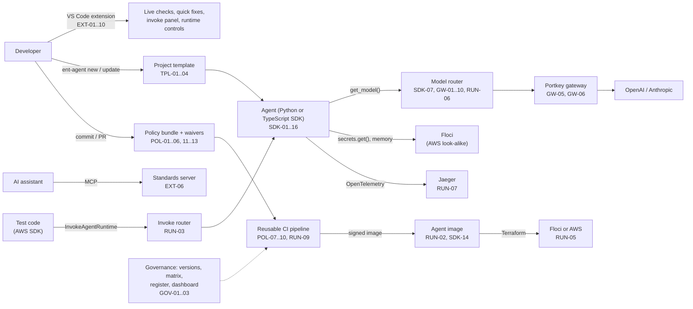

# Requirements reconciliation: what was asked, how the code handles it

> **Note (2026-10-07):** the example agents named below (`hello-agent`, `chat-agent`, `project-assistant`) were removed from the repository; agents are now created in their own folders. This page records what was verified at the time.

One page that answers: **for every requirement in the [spec](requirements-spec.md) (v0.3, 74 requirements), is it
built, where is it in the code, and what is still missing?** Status as of 2026-10-06, after the second build pass
(everything below was built; the "Verified" ones were also run for real).

## How to read this

| Label | Meaning |
|-------|---------|
| ✅ Verified | Built, and shown to work by tests **and** by running it for real (local stack, Floci, real Portkey, Jaeger, Docker, Terraform) |
| 🟡 Built | Code is written and unit-tested, but not yet proven in a real run: it needs something we don't have here (real provider keys, a GitHub run, the policy tools, a real AWS account, VS Code itself) |
| 🟠 Partial | Part of the requirement is done; the "Gap" column says what is missing |
| ⬜ Not built | Not started |
| 🚫 Won't | Explicitly excluded this phase in the spec |
| 📄 Process | An organisational process: the template/documents exist, but the process itself is people's work |

Priorities come from the spec: **M** must, **S** should, **C** could, **W** won't (this phase).

## Scorecard

**74 requirements.** Counts per area and status:

| Area | ✅ Verified | 🟡 Built | 🟠 Partial | ⬜ Not built | 🚫 Won't | 📄 Process | Total |
|------|---:|---:|---:|---:|---:|---:|---:|
| SDK | 14 | · | 2 | · | · | · | 16 |
| TPL | 2 | 2 | · | · | · | · | 4 |
| POL | 3 | 10 | · | · | · | · | 13 |
| RUN | 6 | 3 | 1 | · | · | · | 10 |
| EXT | · | 10 | · | · | · | · | 10 |
| GW | 8 | 1 | 1 | · | · | · | 10 |
| GOV | 3 | · | · | · | · | 1 | 4 |
| NFR | 3 | 1 | 2 | · | · | 1 | 7 |
| **All** | **39** | **27** | **6** | **0** | **0** | **2** | **74** |

**Must-haves (priority M): 46 requirements** - Verified 24, Built 19, Partial 3.

**In one sentence:** every requirement now has working code behind it; more than half have also been proven in real runs (including real Claude and OpenAI answers), and the rest are waiting on things this machine doesn't have (the policy tools, a GitHub run, VS Code itself, a real AWS account, Ollama).

## The picture in one minute



## Where each part lives (reverse view)

| Component | What it does in plain words | Code | Requirements it carries |
|-----------|-----------------------------|------|-------------------------|
| **Agent app** | Serves a LangGraph graph on the AgentCore contract; guardrails, tracing, audit, sessions, approvals, budgets on every call | [app.py](../sdk/src/ent_agent_sdk/app.py) | SDK-01, 03, 08, 10, 11, 12, 13, 16 |
| **Observability** | Trace per call (agent → graph step → model → tool) and JSON logs | [observability.py](../sdk/src/ent_agent_sdk/observability.py) | SDK-03, 04, NFR-03 |
| **Secrets / models / tools** | `secrets.get`, `get_model`, `@tools.tool` | [secrets.py](../sdk/src/ent_agent_sdk/secrets.py), [models.py](../sdk/src/ent_agent_sdk/models.py), [tools.py](../sdk/src/ent_agent_sdk/tools.py) | SDK-05, 07, 09, 10, 16, GW-01, 04 |
| **Guardrails and audit** | Redact/block PII, secrets, injection; separate security event stream | [guardrails.py](../sdk/src/ent_agent_sdk/guardrails.py), [audit.py](../sdk/src/ent_agent_sdk/audit.py) | SDK-08, 13, NFR-03, 07 |
| **Memory, budget, health** | Session memory (DynamoDB), token budgets, gateway health check | [memory.py](../sdk/src/ent_agent_sdk/memory.py), [budget.py](../sdk/src/ent_agent_sdk/budget.py), [health.py](../sdk/src/ent_agent_sdk/health.py) | SDK-11, 12, 16 |
| **Identity, metadata, manifest** | Short-lived credentials; versions in the image; `agent.yaml` | [identity.py](../sdk/src/ent_agent_sdk/identity.py), [metadata.py](../sdk/src/ent_agent_sdk/metadata.py), [manifest.py](../sdk/src/ent_agent_sdk/manifest.py) | SDK-06, 14, TPL-02, POL-06 |
| **CLI and dev tools** | `ent-agent new / update / check / eval / mcp / rules / dev seed` | [cli.py](../sdk/src/ent_agent_sdk/cli.py), [devtools/](../sdk/src/ent_agent_sdk/devtools/) | TPL-01, 03, POL-08, 12, RUN-04, EXT-02, 03, 06 |
| **Project template** | Generated repo: code, Docker, CI, pre-commit, golden questions, MCP config, AI instruction files | [templates/agent/](../sdk/src/ent_agent_sdk/templates/agent/) | TPL-01, 04, POL-10, 13 |
| **TypeScript SDK** | Port of the core for TypeScript agents | [sdk-ts/](../sdk-ts/) | SDK-15 |
| **VS Code extension** | New agent, live checks, quick fixes, runtime status, invoke panel, MCP registration, upgrade, updates, telemetry | [vscode-extension/](../vscode-extension/) | EXT-01…10 |
| **Model router** | Registry, gateway auth, guardrail profiles, limits, cache, failover, telemetry; modes real / record / replay / local | [harness/model-router/](../harness/model-router/) | SDK-07, GW-02…10, RUN-06 |
| **Invoke router** | `InvokeAgentRuntime` to the agent containers, rest to Floci | [harness/invoke-router/](../harness/invoke-router/) | RUN-03 |
| **Local stack** | Floci, Portkey, Jaeger, routers, example agents in one command | [compose.yaml](../compose.yaml), [dev.ps1](../harness/dev.ps1), [dev.sh](../harness/dev.sh), [agent.Dockerfile](../harness/agent.Dockerfile) | RUN-01, 02, 07, 08, 10, GW-06 |
| **Policy bundle** | Rules ENT-001…062, secret scanning, waivers, supported versions, licences | [policy/](../policy/), [rules.md](../policy/docs/rules.md) | POL-01…06, 11…13, GOV-02 |
| **Governance tools** | Compatibility matrix, changelog, waiver register, compliance dashboard, RFC process | [scripts/](../scripts/), [build_register.py](../policy/tools/build_register.py), [rfc/](rfc/) | GOV-01…04, POL-11 |
| **CI pipeline** | Policy → tests → evaluation gate → supply chain → image → sign and attest | [agent-ci.yml](../.github/workflows/agent-ci.yml), [ci.yml](../.github/workflows/ci.yml) | POL-04, 05, 07…10, RUN-08, 09 |
| **Deployment** | Terraform for Floci or AWS, smoke checks | [deploy/](../deploy/) | RUN-05 |

## Reconciliation by area

### SDK: the Enterprise Agent SDK

| ID | Pri | What it asks | How it is handled | Where | Status | Gap / next |
|----|-----|--------------|-------------------|-------|--------|------------|
| SDK-01 | M | One entry point serving a graph on the AgentCore contract | `EnterpriseAgentApp` serves `/invocations` and `/ping` on 8080; runs in the agent containers | [app.py](../sdk/src/ent_agent_sdk/app.py) | ✅ Verified | Not yet deployed to *real* AgentCore |
| SDK-02 | M | Pin approved versions; publish a compatibility matrix | `~=` pins in `sdk/pyproject.toml`; matrix generated from the repo and checked in CI | [pyproject](../sdk/pyproject.toml), [matrix](compatibility-matrix.md) | ✅ Verified | |
| SDK-03 | M | Automatic traces and JSON logs | `GraphTracer` spans for call, steps, models, tools; GenAI attributes; no content recorded | [observability.py](../sdk/src/ent_agent_sdk/observability.py) | ✅ Verified | Seen in Jaeger across agent and router |
| SDK-04 | M | Trace destination by config only | Standard `OTEL_EXPORTER_OTLP_*` settings | [observability.py](../sdk/src/ent_agent_sdk/observability.py) | ✅ Verified | Enterprise backend (Fiddler, Datadog) not tried |
| SDK-05 | M | `secrets.get()`, cached, works on Floci | Secrets Manager + SSM, 5-min cache, fails closed | [secrets.py](../sdk/src/ent_agent_sdk/secrets.py) | ✅ Verified | |
| SDK-06 | M | Short-lived credentials for outbound calls | `StsIdentity` (verified against Floci STS) and `AgentCoreIdentity` (OAuth via AgentCore Identity) | [identity.py](../sdk/src/ent_agent_sdk/identity.py) | 🟠 Partial | The AgentCore token calls return 404 on Floci, so they are covered by stubbed tests only: verify on real AWS |
| SDK-07 | M | Models by logical name via the registry, through Portkey | `get_model()` talks only to the router; registry maps names to providers and fallbacks; unapproved name gives 400; the router adds a default token limit (Anthropic requires one) and provider parameters (OpenAI fallback needs reasoning off for tools) | [models.py](../sdk/src/ent_agent_sdk/models.py), [registry.json](../harness/model-router/registry.json) | ✅ Verified | Real answers from `claude-opus-5-5` and `claude-haiku-4-5`, tool calls included, and the `gpt-5.6-sol` fallback, all checked live |
| SDK-08 | M | Layered guardrails; disabling needs a detectable waiver | Layer 2 in the SDK (profiles standard/strict, Bedrock adapter) and layer 1 at the gateway (Portkey hooks); `Guardrails.off(waiver=…)` checked by the waiver tool | [guardrails.py](../sdk/src/ent_agent_sdk/guardrails.py), [registry.json](../harness/model-router/registry.json) | ✅ Verified | Both layers shown blocking live; waiver check not yet run in a GitHub pipeline |
| SDK-09 | S | Tool registry and allowlist | `@tools.tool(owner, classification, side_effects)`; unregistered tools refused; metadata on spans | [tools.py](../sdk/src/ent_agent_sdk/tools.py) | ✅ Verified | |
| SDK-10 | S | Human approval for side-effect tools | Tool pauses the graph (`interrupt`); caller gets 202 + approval request; `{"resume": …}` continues; rejection returns "not approved" to the model; audited | [tools.py](../sdk/src/ent_agent_sdk/tools.py), [app.py](../sdk/src/ent_agent_sdk/app.py) | ✅ Verified | |
| SDK-11 | S | Memory/state adapters | Session memory per session header; in-memory or DynamoDB (survives restarts, shown against Floci); chosen by manifest/env | [memory.py](../sdk/src/ent_agent_sdk/memory.py) | ✅ Verified | AgentCore Memory adapter not built (the API was not verified) |
| SDK-12 | S | Cost and token budgets | `token_budget {soft, hard}`: warn once, refuse the next model call, 429 `BudgetExceeded`; audited | [budget.py](../sdk/src/ent_agent_sdk/budget.py) | ✅ Verified | Tokens only (no money); streaming calls without usage aren't counted |
| SDK-13 | M | Audit events | Own JSON stream with agent, user, session, trace; guardrails, side-effect tools, approvals, waivers, budgets; never content | [audit.py](../sdk/src/ent_agent_sdk/audit.py) | ✅ Verified | |
| SDK-14 | M | SDK and policy versions in the image | Written at build, on every trace, readable with `ent-agent metadata` | [metadata.py](../sdk/src/ent_agent_sdk/metadata.py) | ✅ Verified | |
| SDK-15 | W | TypeScript SDK | Port of the core: app, tracing, secrets, models, guardrails, audit, tools, manifest, budget; 71 tests incl. cross-language contract tests and Floci | [sdk-ts/](../sdk-ts/) | 🟠 Partial | Not ported: approvals, memory backends, identity, health module, dev tools, Bedrock guardrail (listed in its README) |
| SDK-16 | M | Resilience complementing Portkey | Timeouts + bounded retries (AWS, tools); `/ping` Unhealthy when the gateway is down (default from the manifest); gateway outage → 503 `GatewayUnavailable`; graceful shutdown; model retries left to Portkey | [health.py](../sdk/src/ent_agent_sdk/health.py), [app.py](../sdk/src/ent_agent_sdk/app.py) | ✅ Verified | |

### TPL: template and scaffolding

| ID | Pri | What it asks | How it is handled | Where | Status | Gap / next |
|----|-----|--------------|-------------------|-------|--------|------------|
| TPL-01 | M | Ready-to-run agent repo | `ent-agent new` writes code, tests, Docker, compose, CI, pre-commit, golden questions, MCP config, manifest | [scaffold.py](../sdk/src/ent_agent_sdk/devtools/scaffold.py) | 🟡 Built | Generated agent verified by tests; its own Docker build and the "30 minutes" goal not tried (SDK isn't on a package index) |
| TPL-02 | M | `agent.yaml`, validated everywhere | Python, JSON Schema and Rego forms; the checker also runs inside the IDE engine | [manifest.py](../sdk/src/ent_agent_sdk/manifest.py), [manifest.rego](../policy/opa/manifest.rego) | 🟡 Built | Python path verified live; Rego unrun |
| TPL-03 | S | Pull template updates into existing repos | `ent-agent update`: reviewable diff, updates untouched files, keeps your edits, conflicts get `<file>.template-new`, deleted files stay deleted | [scaffold.py](../sdk/src/ent_agent_sdk/devtools/scaffold.py) | ✅ Verified | |
| TPL-04 | M | AI-assistant instruction files | `CLAUDE.md`, `AGENTS.md`, `.github/copilot-instructions.md` + MCP config in every project | [templates/agent/](../sdk/src/ent_agent_sdk/templates/agent/) | ✅ Verified | |

### POL: policy and CI enforcement

| ID | Pri | What it asks | How it is handled | Where | Status | Gap / next |
|----|-----|--------------|-------------------|-------|--------|------------|
| POL-01 | M | Dependency allowlist | Rego rules and the same rules in the in-process checker (ENT-010…012) | [dependencies.rego](../policy/opa/dependencies.rego), [lint.py](../sdk/src/ent_agent_sdk/devtools/lint.py) | 🟡 Built | Python checker verified; Conftest not installed, so the Rego never ran |
| POL-02 | M | Required usage patterns | Semgrep rules ENT-001…009 and the same rules in the in-process checker | [ent-agent.yml](../policy/semgrep/ent-agent.yml) | 🟡 Built | Checker verified; Semgrep not installed |
| POL-03 | M | Secret scanning | gitleaks config; pre-commit and pipeline steps | [gitleaks.toml](../policy/gitleaks.toml) | 🟡 Built | gitleaks not installed |
| POL-04 | M | SAST and vulnerability scanning | Pipeline runs pip-audit and Semgrep | [agent-ci.yml](../.github/workflows/agent-ci.yml) | 🟡 Built | Pipeline never run on GitHub |
| POL-05 | M | SBOM and licence policy | CycloneDX SBOM; licence check | [check_licenses.py](../policy/tools/check_licenses.py) | 🟡 Built | Licence tool unit-tested; pipeline unrun |
| POL-06 | M | Manifest validation | `ent-agent manifest validate` + Rego ENT-020…023 | [manifest.rego](../policy/opa/manifest.rego) | 🟡 Built | Python path verified; Rego unrun |
| POL-07 | M | Unit + local-runtime integration tests in CI | Test job starts the stack in replay mode, seeds, runs integration tests | [agent-ci.yml](../.github/workflows/agent-ci.yml) | 🟡 Built | Same flow verified locally; GitHub run pending |
| POL-08 | S | Evaluation gate with minimum scores | `ent-agent eval run`: golden questions, scores per dimension (task success, safety, groundedness), thresholds, JSON report; pipeline step | [evals.py](../sdk/src/ent_agent_sdk/devtools/evals.py) | ✅ Verified | Run live against hello-agent; the pipeline step itself is unrun |
| POL-09 | S | Image signing and provenance | Pipeline job: multi-arch build, push, cosign keyless signing, SLSA provenance; `verify_image.sh` as the deploy gate | [agent-ci.yml](../.github/workflows/agent-ci.yml), [verify_image.sh](../policy/tools/verify_image.sh) | 🟡 Built | Needs GitHub + a registry to run |
| POL-10 | M | Reusable pipeline repos can't weaken | `agent-ci.yml` reusable; `check_pipeline.py` meta-check | [check_pipeline.py](../policy/tools/check_pipeline.py) | 🟡 Built | Meta-check tested; GitHub only |
| POL-11 | M | Time-boxed, approved waivers; central register | `waivers.yaml` rules + checker; `build_register.py` builds the central register (JSON/Markdown) across repos | [check_waivers.py](../policy/tools/check_waivers.py), [build_register.py](../policy/tools/build_register.py) | ✅ Verified | Register tested on sample repos; no real fleet yet |
| POL-12 | M | Clear failures with ID, reason, fix | One catalogue → rules page with a bad/good example per rule; in-process checker returns one-click fixes | [rules_catalog.py](../sdk/src/ent_agent_sdk/devtools/rules_catalog.py), [rules.md](../policy/docs/rules.md) | ✅ Verified | |
| POL-13 | M | Pre-commit runs the fast rules | `run-checks --fast` in `.pre-commit-config.yaml` (bash and PowerShell) | [run-checks.sh](../policy/run-checks.sh) | 🟡 Built | Needs the tools installed |

### RUN: local runtime and test harness

| ID | Pri | What it asks | How it is handled | Where | Status | Gap / next |
|----|-----|--------------|-------------------|-------|--------|------------|
| RUN-01 | M | One command starts the stack | `dev.ps1 up` / `dev.sh up` | [dev.ps1](../harness/dev.ps1) | ✅ Verified | Start-up time not measured |
| RUN-02 | M | Local image = deployed image | One multi-stage, non-root image | [agent.Dockerfile](../harness/agent.Dockerfile) | ✅ Verified | |
| RUN-03 | M | `InvokeAgentRuntime` reaches the local agent | Invoke router (resolves Floci's ARNs) | [invoke-router](../harness/invoke-router/src/invoke_router/app.py) | ✅ Verified | |
| RUN-04 | M | Seed secrets, data, AgentCore resources from the manifest | `ent-agent dev seed`: secrets, buckets, tables, session-memory table, AgentCore memories, runtime; idempotent | [seed.py](../sdk/src/ent_agent_sdk/devtools/seed.py) | ✅ Verified | AgentCore gateways not seeded |
| RUN-05 | S | Rehearse deploy scripts against Floci | Terraform module with `target = local | aws`, `deploy.ps1` with smoke checks; verified apply and destroy on Floci | [deploy/](../deploy/) | ✅ Verified | The `aws` target is only validated, never applied; Linux provider hashes and a remote state backend still to add |
| RUN-06 | M | LLM in local runs: real, replay or local model | Router modes real / record / replay / local; record and replay shown live with real answers (1.4 s live, 30 ms replayed, identical text); recordings hold answers only | [model-router](../harness/model-router/src/model_router/app.py), [recordings.py](../harness/model-router/src/model_router/recordings.py) | 🟠 Partial | The `local` (Ollama) mode is unit-tested only: Ollama is not installed |
| RUN-07 | S | Local trace viewer | Jaeger | [compose.yaml](../compose.yaml) | ✅ Verified | In-memory |
| RUN-08 | M | Windows, macOS, Linux; AMD64 and ARM64 | `dev.sh` for bash; CI matrix over 4 OS/CPU combinations and image builds on amd64 and arm64 | [ci.yml](../.github/workflows/ci.yml), [dev.sh](../harness/dev.sh) | 🟡 Built | Only Windows / AMD64 has actually run |
| RUN-09 | M | Runs inside CI runners | `compose.ci.yaml` (replay), pipeline test job | [compose.ci.yaml](../compose.ci.yaml) | 🟡 Built | Never run on a CI runner |
| RUN-10 | C | Optional Docker-socket mode | Opt-in override file and a risk note; off by default | [compose.docker-socket.yaml](../compose.docker-socket.yaml), [doc](docker-socket-mode.md) | 🟡 Built | Deliberately not exercised (it would mount the socket) |

### EXT: VS Code extension

Built in [vscode-extension/](../vscode-extension/): 39 unit tests pass and the `.vsix` packages. **VS Code itself could not be launched here, so everything that calls the VS Code API has never run**; that is why all ten are 🟡.

| ID | Pri | What it asks | How it is handled | Where | Status | Gap / next |
|----|-----|--------------|-------------------|-------|--------|------------|
| EXT-01 | M | "New Agent" command | Guided inputs → `ent-agent new` | `src/newAgent.ts` | 🟡 Built | Try it in VS Code |
| EXT-02 | M | Live policy diagnostics | Runs `ent-agent check --json` on open/save (debounced); rule IDs link to the rules page | `src/diagnostics.ts`, `core/` | 🟡 Built | Core + integration test with the real CLI pass; editor behaviour unverified |
| EXT-03 | S | Quick fixes | Code actions from the checker's fix objects (model → `get_model`, env secret → `secrets.get`) | `src/codeActions.ts`, `core/fix.ts` | 🟡 Built | Fix logic tested; applying in the editor unverified |
| EXT-04 | M | Runtime controls and health | Status bar polling Floci/Jaeger/routers/agents; start/stop, open Floci UI / Jaeger | `src/runtime.ts` | 🟡 Built | Probe logic tested against real servers |
| EXT-05 | S | Invoke & test panel | Webview: response, status, guardrail outcome, trace link; localhost only; strict CSP | `src/invokePanel.ts` | 🟡 Built | Panel logic tested; webview unverified |
| EXT-06 | M | AI assistant integration | MCP standards server (`ent-agent mcp`, verified over real stdio) registered in VS Code, plus instruction files | [mcp_server.py](../sdk/src/ent_agent_sdk/devtools/mcp_server.py), `src/assistant.ts` | 🟡 Built | Server verified; registration in VS Code and the "80% compliant code" benchmark unmeasured |
| EXT-07 | S | Snippets and code lenses | Six snippets; lenses above `@tools.tool` and on `agent.py` | `snippets/`, `src/lenses.ts` | 🟡 Built | |
| EXT-08 | S | Upgrade assistant | Compares the project's SDK with `versions.json`; Upgrade / Changelog actions | `src/upgrade.ts` | 🟡 Built | |
| EXT-09 | M | Internal distribution with auto-update | `.vsix` packaging, private feed script, update checker; options doc | [distribution doc](extension-distribution.md) | 🟡 Built | Needs an actual internal feed |
| EXT-10 | C | Opt-in anonymised telemetry | Off by default; fixed event list, no code/paths/prompts; sanitiser tested | `src/telemetry.ts` | 🟡 Built | |

### GW: LLM gateway (Portkey)

| ID | Pri | What it asks | How it is handled | Where | Status | Gap / next |
|----|-----|--------------|-------------------|-------|--------|------------|
| GW-01 | M | All LLM traffic through Portkey | `get_model` reaches only the router, which reaches only Portkey; rules ENT-001…003 flag bypasses | [models.py](../sdk/src/ent_agent_sdk/models.py) | 🟡 Built | Blocking provider egress in deployed networks is out of local scope |
| GW-02 | M | Provider keys only in the gateway layer | Router reads provider keys from Secrets Manager; each agent has its own gateway credential; wrong or missing → 401 | [controls.py](../harness/model-router/src/model_router/controls.py) | ✅ Verified | Dev keys in compose; use real secrets per team in a deployment |
| GW-03 | M | Central routing config per logical model | `registry.json` | [registry.json](../harness/model-router/registry.json) | ✅ Verified | |
| GW-04 | M | Correlate gateway logs with traces | Agent trace ID, name, version, team, profile on every request; router span joins the agent's trace | [models.py](../sdk/src/ent_agent_sdk/models.py) | ✅ Verified | Seen in Jaeger |
| GW-05 | M | Gateway guardrails as layer 1 | Portkey before/after hooks per profile: `standard` blocks credentials; `strict` also personal data | [registry.json](../harness/model-router/registry.json) | ✅ Verified | Blocking shown live on the real gateway; regex-based |
| GW-06 | M | Portkey in the local and CI stack | Pinned `portkeyai/gateway:1.15.2` | [compose.yaml](../compose.yaml) | ✅ Verified | |
| GW-07 | S | Budgets and rate limits per team/agent | Router: requests per minute (429 + Retry-After) and tokens per UTC day per client | [controls.py](../harness/model-router/src/model_router/controls.py) | ✅ Verified | Both shown live (the token budget with real usage); in-memory per process, so a stand-in for Portkey enterprise budgets |
| GW-08 | S | Gateway telemetry to enterprise observability | A router span per call (client, profile, status, tokens), exported over standard OTLP | [app.py](../harness/model-router/src/model_router/app.py) | ✅ Verified | Seen in Jaeger; not tried with an enterprise backend |
| GW-09 | C | Caching | Exact-match cache for opted-in models and non-sensitive callers (a miss took 811 ms, the hit 39 ms; restricted callers are never cached) | [controls.py](../harness/model-router/src/model_router/controls.py) | ✅ Verified | Semantic caching is enterprise-only |
| GW-10 | M | High availability; clear error if the gateway is down | Several instances with round-robin and failover (shown live: dead instance skipped); clear 502/503; never bypasses the gateway; design in [gateway-ha.md](gateway-ha.md) | [controls.py](../harness/model-router/src/model_router/controls.py) | 🟠 Partial | A real two-instance production deployment is not built (open decision on the production model) |

### GOV and NFR: governance and quality

| ID | Pri | What it asks | How it is handled | Where | Status | Gap / next |
|----|-----|--------------|-------------------|-------|--------|------------|
| GOV-01 | M | Semantic versions and a compatibility matrix | Matrix generated from the repo and checked in CI; changelog | [matrix](compatibility-matrix.md), [CHANGELOG](../CHANGELOG.md) | ✅ Verified | |
| GOV-02 | M | Deprecation policy enforced by CI | `versions.json` (supported series, sunset dates); `check_versions.py` fails past sunset (ENT-060), warns within 90 days (ENT-061) | [check_versions.py](../policy/tools/check_versions.py), [versions.json](../policy/data/versions.json) | ✅ Verified | Wired into the runner and pipeline; no sunset dates exist yet |
| GOV-03 | S | Compliance dashboard | Static HTML dashboard + register from a list of repos: SDK status, policy findings, waivers | [build_register.py](../policy/tools/build_register.py) | ✅ Verified | Needs a scheduled job over the real repos |
| GOV-04 | S | Standards change process (RFC) | Process and template | [docs/rfc/](rfc/README.md) | 📄 Process | The people process is yours |
| NFR-01 | n/a | SDK overhead < 20 ms p95; checks < 2 s | Measured: 2.9-3.6 ms p95 overhead, 15 ms for policy checks; CI re-checks | [performance.md](performance.md) | ✅ Verified | Full CI policy stage not timed (tools not installed) |
| NFR-02 | n/a | Least privilege, no long-lived credentials, no real AWS unless configured, no Docker socket | Runtime secrets; per-agent gateway credentials; seeding refuses non-local endpoints; socket never mounted by default; non-root containers | various | 🟠 Partial | Real-AWS identity unverified; IAM not enforced by Floci |
| NFR-03 | n/a | Telemetry fails open; guardrails and secrets fail closed | As built and tested | various | ✅ Verified | |
| NFR-04 | n/a | Every rule documented with examples; one-page onboarding | Generated rules page with bad/good examples; [onboarding](onboarding.md) | [rules.md](../policy/docs/rules.md) | ✅ Verified | |
| NFR-05 | n/a | Portable across OS and CPU | See RUN-08 | | 🟡 Built | Only Windows / AMD64 has run |
| NFR-06 | n/a | Support channel and SLA | [Support model](support.md) with severities and targets (fill in names/channels) | | 📄 Process | The on-call and channels are yours |
| NFR-07 | n/a | Decisions, waivers and builds traceable | Audit stream; build metadata on traces/image; central waiver register | | 🟠 Partial | Policy decisions aren't stored centrally yet (CI logs and artifacts only) |

## What to do next (biggest gaps first)

1. **Rotate the provider keys** that were pasted into chat for testing (see the session log), and install Ollama if the `local` model mode matters (RUN-06).
2. **Install the policy tools** (Semgrep, Conftest, gitleaks, about 100 MB): moves POL-01…03, 06, 13 and TPL-02 to Verified.
3. **Run the pipeline once on GitHub** (push the repo, tag `v0.1.0`): POL-04, 05, 07, 09, 10, RUN-08, 09. Pin tool versions while you are there; add Linux hashes to the Terraform lock file.
4. **Try the extension in VS Code** (install the `.vsix`): the ten EXT items.
5. **Real AWS sandbox**: AgentCore Identity tokens (SDK-06), the Terraform `aws` target (RUN-05), real AgentCore deployment (SDK-01, RUN-02).
6. **Decisions still open**: production gateway model (self-hosted / hosted / hybrid), CI platform beyond GitHub, enterprise observability backend, Portkey enterprise or not.

## Re-checking this yourself

```powershell
uv run pytest                                  # 250+ Python tests (SDK, routers, policy and governance tools, examples)
.\harness\dev.ps1 up -Mode replay              # the whole stack, seeded
uv run ent-agent check examples                # the policy rules, in milliseconds
uv run ent-agent eval run examples/hello-agent/evals/golden.yaml --url http://localhost:8080
uv run python scripts/bench_overhead.py --check
. .\harness\env.ps1; (cd vscode-extension; npm test); (cd sdk-ts; npm test)
```
